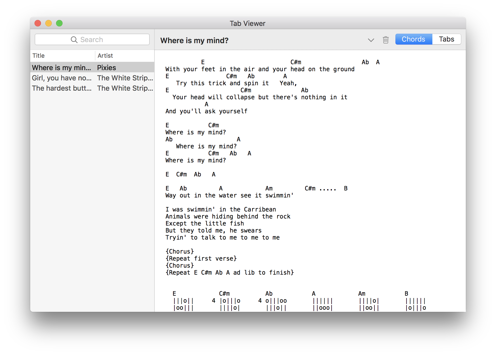

#  Tab Viewer

A macOS native app for managing your library of guitar tabs.

Download the latest version [here](https://github.com/zac-garby/Tab-Viewer/releases)!

Features:

 - Importing from files (`⌘I`)
 - Searching by title or artist
 - Storing both the tabs and the chords for each song
 - Auto-scrolling, customisable speed

Features I want to add in the future:

 - Importing entire directories of files
 - In-app editing of tabs
